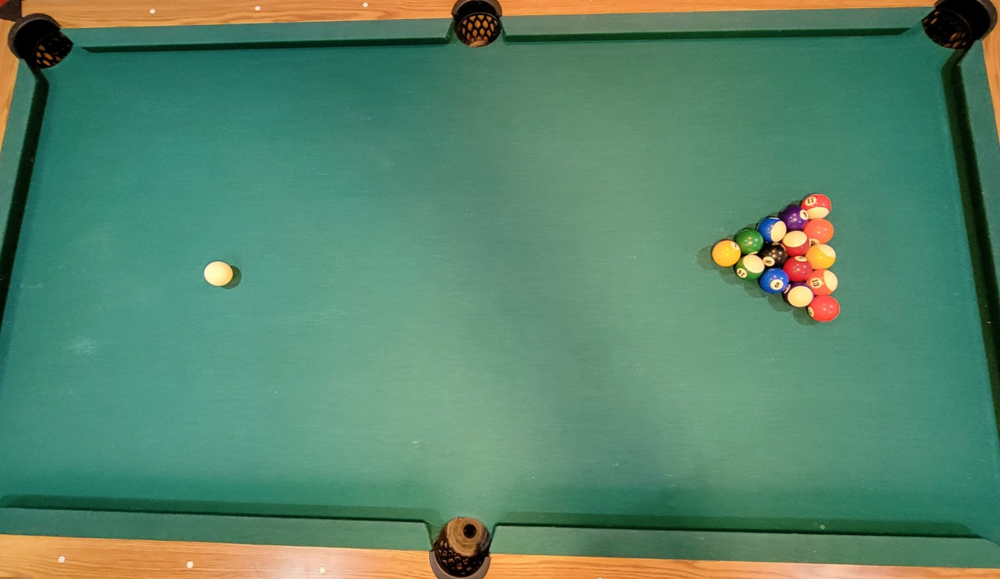
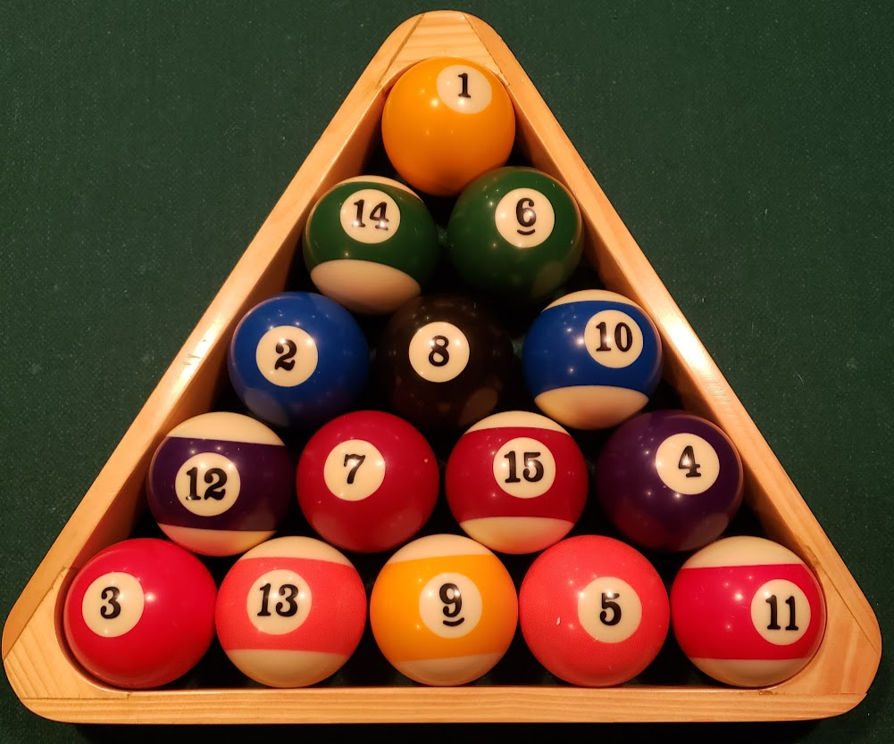
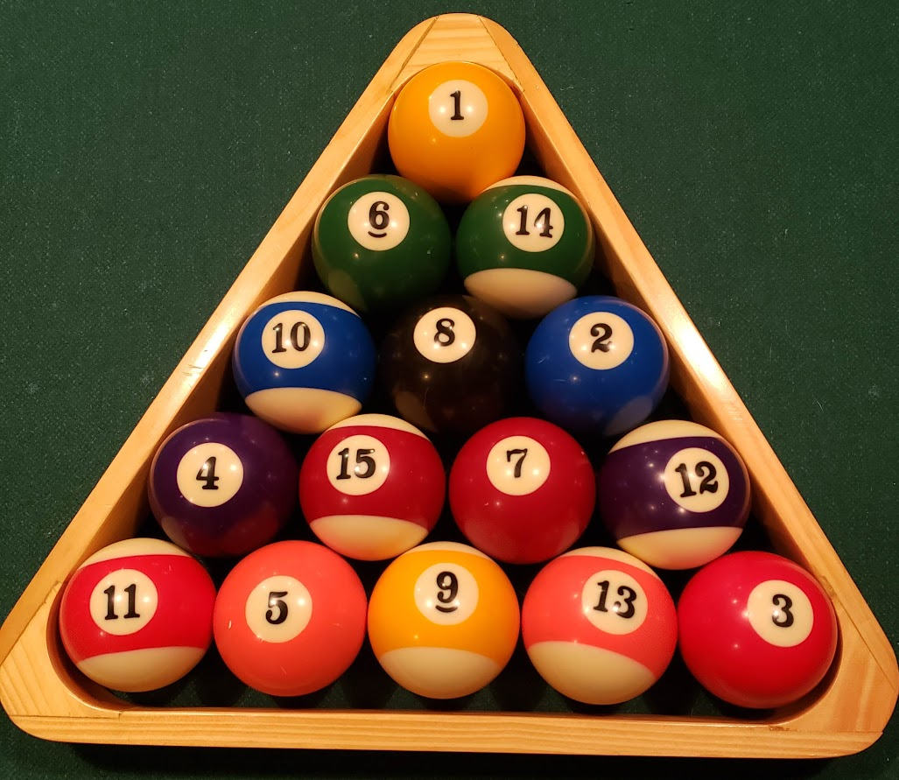
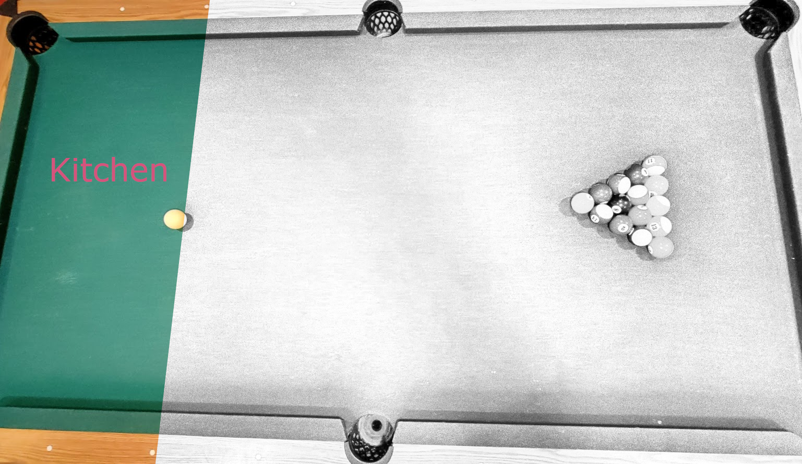

# Pool The Rainbow
Family Friendly Billards Game for All Skill Levels (a.k.a.  Skittles)
This game was created during the global COVID-19 Pandemic in the year 2020 by Chris Cline. 
It was nicknamed "Skittles" by Madelyn Cline, due to the colorful nature of the ball pattern.
  
# Overview
Pool The Rainbow is a billards game designed to put players of different skill levels on a more equal playing field.  It does so by allowing some features that are generally disallowed in regular billard games; slop, out of order balls, ball combinations, etc.  Since it allows more flexibility in how a player's turn can be played, it also creates some interesting strategies where you can intentionally block subsequent players from being successful during their turns.

This game is targeted to be played by either 2 players or 2 teams of players.  The processes of the game that make it unique are the predetermined ball racks, the choosing of the breaker, how an open table can get closed, the uniqueness in how the game is won and the simple fact that it can result in a tie.
# Setting Up The Rack
There are two allowable combinations of ball order racks.  As you can see in the images for each rack, the colors of the balls make up the rainbow.  The two racks are called left-handed and right-handed racks.  All balls MUST be in one of these two orders.  Historically, the method of selecting which rack to use was based off of the individual performing the rack.  If they were left hand dominant, they would choose the left handed rack.  Ultimately, it doesn't matter which rack is selected, but it must be one of the following.
## Left Handed Rack ##
   Note that within a Left Handed Rack, the #2 and #3 balls is on the left.
  
## Right Handed Rack ##
  Note that within a Left Handed Rack, the #2 and #3 balls is on the right.
  
# Choosing the Breaker
The breaker can be determined in a number of different ways.  The goal is to make it fun for your group.  Feel free to use any of the methods listed below or make up your own mechanism to select the initial breaker.  If you come up with a fun method of selecting the initial breaker, please let us know and we'll update the list.
- [Rock Paper Scissors](https://en.wikipedia.org/wiki/Rock_paper_scissors)
- [Staring Contest](https://en.wikipedia.org/wiki/Staring#Staring_contests)
- [Flip-A-Coin](https://en.wikipedia.org/wiki/Coin_flipping)

# Open Table
The table is considered open at the start of each game.  The rack is considered not broken until either the #1 ball or the #9 ball has been fully moved out of it's original rack position.
## Breaker Round ##
If the current rack has not been broken, then the current player is called the breaker.  The job of the breaker is to utilize the cue ball to target and hit the rack of balls.  The breaker may place the cue ball anywhere within the kitchen and hit strike the ball toward the rack leveraging the cue stick.  In order for a valid break to have occurred, the breaker must ***move*** either the #1 or the #9 ball out of it's original rack position upon striking the rack.  If the breaker fails to do so with their first shot, it is considered a scratch and the next player will have a turn at being the breaker.  This process will continue until the rack has been broken.  Note that each breaking shot must begin within the kitchen area regardless of the number of times the breaker role is attempted.

Once the rack has been successfully broken, any balls that have been sunk within a pocket during the break is considered out of play.  
The following rules apply to any balls sunk during the break.
 - If the #8 ball is sunk during the break the game will end with an automatic win in the favor of the current breaker.  
 - If the #1 or #9 ball is sunk, that will close the table and the breaker will be assigned their respective color, and the table will be closed.
   - The color of **SOLIDS** is designated if the #1 ball is sunk.
   - The color of **STRIPES**, if the #9 ball is sunk.
 - If both the #1 and #9 balls are both sunk during the break, the breaker will be allowed to choose if they would like SOLIDS or STRIPES.  The table will now be considered closed.
 - In the event balls other than #1, #8 or #9 are sunk, they are now considered out of play.  The current breaker will retain their turn but become the current shooting player.
## Shooting Player ##
Once the rack has been broken, the current player is known as the shooter.  They will retain this title until such time as the table is closed.
The current shooter will leverage the cue ball (at it's current position, if the previous play did not result in a scratch) to target any balls on the table.  The table will remain open until such time as either the #1 or #9 ball has been sunk into a pocket.  Sinking either of these balls will close the table and select which color (solid or stripes) that the shooting player has been assigned.  During their turn, the shooter can target any balls or ball combinations on the table in an attempt to sink the #1 or #9 ball.  While the table remains open, the shooter shall retain their turn simply by sinking any (non #8) ball.  If the shooter does not sink any ball or close the table, their turn will end and the next player will become the shooter.  It is possible for the shooter to scratch by not sinking a ball AND not moving either the #1 or #9 balls during their turn. Should a scratch occur during the shooting round, the next shooter must restart their turn with the cue ball within the kitchen.  If the shooter sinks the #8 ball on the same strike as closing the table, the game will end with a win by the shooter.  If the shooter sinks the #8 ball without closing the table with the same strike, then the game will end with a loss by the shooter.  
# Closed Table
The table is considered closed once the #1 or #9 ball is sunk within a pocket.  This will also determine if the shooter is assigned the color of SOLIDs or STRIPEs.  The current player is now given the title as contender and the rounds of play will change.
# Contender Round
The current contender will start their round at the current cue ball location.  If the previous contender's turn resulted in a scratch then the current contender will place the ball within the kitchen and their next shot must leave the kitchen prior to striking another ball.

During this round, the contender must ***move*** the lowest available ball of their color to avoid a scratch.  This can be done leveraging slop or using any ball combination (including other player's color).  Any (non-#8) ball may be sunk during the contender's turn and they will be considered out of play.  The contender may only retain their turn if they sink their lowest available ball during the strike.  If the contender fails to sink their lowest available ball, their turn will end and the next player will become the new contender.  If the contender sinks the #8 ball during their turn while still posessing another ball of their designated color, the game will end with a loss for the current contender.  If the contender sinks all of their remaining designated color balls they will have a shot at the #8 ball.  At this point, the contender's strike may result in a scratch by not moving the #8 ball or by sinking an Underdog's ball (without also sinking the #8 ball).  By sinking the #8 ball will take the game into sudden death.  The current contender will retain the title of contender and the non-current player is now considered the underdog.
# Sudden Death Round
## Contender's Turn ##
During the sudden death round, the contender may target any balls of the other player.  As long as the contender sinks a ball, they will retain their turn until such time as all balls have been sunk, they scratch or they fail to sink a ball.  If the contender sinks the last remaining ball the game will end with a win for the contender.
## Underdog's Turn ##
During the underdog's turn, they must continue to sink the lowest possible ball of their color.  They will retain their turn until such time as all balls have been sunk, they scratch or fail to the sink the next lowest available ball of their color.  If the underdog sinks the last remaining ball, the game will end in a tie.
# Winning the Game
The game can be won in a number of different ways.  The following are the ways in which the game can be won.
* The #8 ball is sunk by the breaker of the rack during the breaking shot.  The breaker will be designated as the winner.
* The #8 ball is sunk by the shooter during the same strike as closing the table by sinking either the #1 or the #9 ball.  The shooter will be designated as the winner.
* The #8 ball is sunk by the shooter during the shooting round without closing the table.  This will result in the non-shooting player being designated as the winner.
* The #8 ball is sunk during any other round of play without also sinking all balls of the current players designated color.  The non-current player will be designated as the winner.
* The contender sinking the last remaining ball of the underdog's designated color.
# Tying the Game
The game can be tied only by the underdog sinking the last ball of their own designed color.
# Strategies :: TODO
# Definitions
* Breaker
  >The breaker is the current player responsible for targeting the rack with the cue ball while the table is considered open and the rack has not been broken.  This individual is responsible for striking the cue ball in such a manner that it will ***move*** either the #1 ball or the #9 ball out of their original location by a substantial margin, ultimately defined by the width of the ball.
* Contender
  * Contender Round
    >During the the Contender Round, the contender is identified as the current player.
  * Suddend Death Round
    >During the Sudden Death Round, the contender is the player who has sunk all of the balls within their designated color as well as the #8 community ball.  This player can win the game by sinking the last remaining ball for the underdog.
* Kitchen
  >The kitchen is the location on the table opposite the racked set of balls behind the first 2 series of dots.  When required to place the cue ball within the kitchen, the cue can be set down anywhere behind the first two series of dots.  On a breaking shot or immediately following a scratch, the cue ball must be struck in a manner in which it leaves the kitchen area ***prior*** to striking another ball.
  
* Scratching
  >A scratch is defined as anytime the general rules of a turn are violated.  This can be any of the following
  * Striking the cue ball in such a manner that causes it (or another ball) to leave the table.
  * Not moving either the #1 or the #9 ball during the breaking round.
  * Not moving either the #1 or the #9 ball during the shooting round, while also not sinking another (non-#8) ball.
  * Not moving the the lowest available numbered ball of the current players designated color, while also not sinking another ball.  This rule does not apply to the contender during the sudden death round, but does apply to the underdog.
* Shooter
  >The shooter is the current player responsible for targeting the balls on an open table after the rack has been broken, but before colors have been designated.  The shooter will need to sink either the #1 or the #9 ball in order to designate a color for themself.
* Slop
  >This is a general term for striking the cue ball without any intentional target or strategy and simply letting the balls do what they will.  This is always allowed, but could result in a scratch based on the scratch rules.
* solids
  >The color of *solids* is the designation for the player who is responsible for the balls numbered 1 - 7.  The number 8 ball is a community ball.
* stripes
  >The color of *stripes* is the designation for the player who is responsible for the balls numbered 9 - 15.  The number 8 ball is a community ball.
* Underdog
  >The underdog is the player who is defending their balls from being sunk by the contender during the Sudden Death Round.  If the underdog is able to sink the last remaining ball of their designated color before the contender can, then the game will end in a tie.
